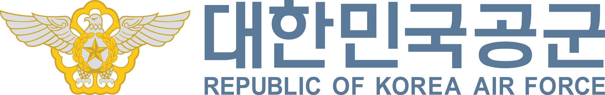

## Education
|Degree|Major|Organization|Location|Period|
|:-:|:-:|:-:|:-:|:-:|
|Master of Science|Computer Science| The University of Texas at Austin|Austin, TX Remote|Jan, 2027 - |
|Bachelor of Science in Engineering|Computer Engineering| Inha University \| 인하대학교|Incheon, Korea|Mar, 2018 - Feb, 2024|

## Experience
|Title|Organization|Location|Period|
|:-:|:-:|:-:|:-:|
|Project Manager RAN NPI| Rakuten Mobile, Inc. \| 楽天モバイル株式会社|Tokyo, Japan|Apr, 2025 - Present|
|Software Engineer SSgt(E-5)| Republic of Korea Air Force \| 대한민국 공군|Osan Air Base|Jul, 2019 - Apr, 2021|

## Languages

